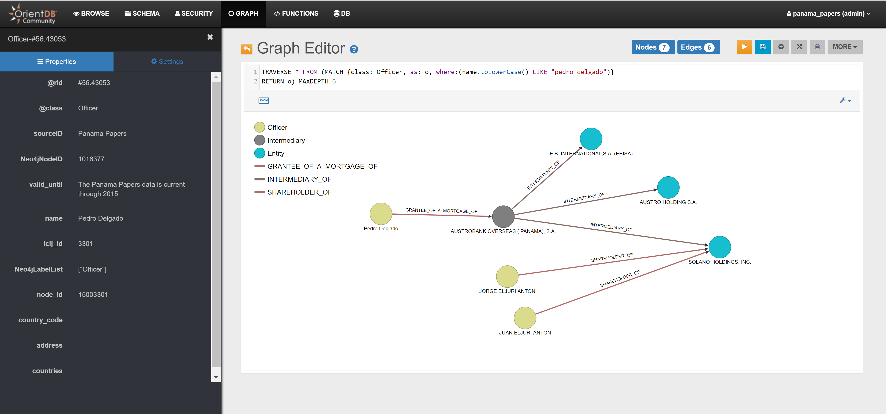

**work in progress**


# panama-papers-orientdb



## Introduction

Hello and welcome to the panama-papers-orientdb repository!

The aim of this repository is to make the Panama Papers database available in OrientDB, the Graph/Document Multi-Model Database

We have imported the Panama Papers database into OrientDB using the [Neo4j to OrientDB Importer](http://orientdb.com/neo4j-to-orientdb-importer/)

Please open an issue if you have any questions or problems

Many thanks,


## Downlading a ready-to-use version

To download a ready-to-use version of the Panama Paper database imported into OrientDB:

- Download the `panama_papers.zip` archive from this link (put link here)
- Unzip `panama_papers.zip` into the `databases` directory of your OrientDB installation
- Start the server `ORIENTDB_HOME\bin\server.sh` (or `server.bat` in Windows)

## Querying the Panama Papers DB

Some query examples are reported below (please execute them from the "Graph Editor" Tab; double click on a node to expand it):

Example #1

```
MATCH {class: Officer, as: o, where:(name.toLowerCase() LIKE "pedro delgado")}
RETURN $pathelements
```

```
TRAVERSE * FROM (MATCH {class: Officer, as: o, where:(name.toLowerCase() LIKE "pedro delgado")}
RETURN o) MAXDEPTH 6
```

Example #2

```
TRAVERSE * FROM (MATCH {class: Officer, as: o, where:(name LIKE "Ólöf Nordal")}
RETURN $pathelements) MAXDEPTH 4
```

## High-level migration steps

Step 1: Download and unpack the Panama Papers database

```
$wget https://cloudfront-files-1.publicintegrity.org/offshoreleaks/neo4j/panama-papers-mac-2016-10-05.tar.gz#_ga=1.4153013.449426429.1475852504
$tar xvf panama-papers-mac-2016-10-05.tar.gz
$cd panama-papers/
$mv ICIJ\ Panama\ Papers/ ICIJ_Panama_Papers/ 
```

Step 2: Download and install [OrientDB](http://orientdb.com/download/) and the [Neo4j to OrientDB Importer](http://orientdb.com/neo4j-to-orientdb-importer/), e.g.

```
$ wget http://mkt.orientdb.com/CE-2217-multiOS -O orientdb-community-2.2.17.zip
$ unzip orientdb-community-2.2.17

$ wget http://mkt.orientdb.com/importer-2217-tar -O orientdb-neo4j-importer-2.2.17.tar.gz
$ tar xfv orientdb-neo4j-importer-2.2.17.tar.gz -C orientdb-community-2.2.17 --strip-components=1
```

Step 3: Migrate the database from Neo4j to OrientDB with a command similar to the following:

```
./orientdb-neo4j-importer.sh -neo4jlibdir ~/santo/neo4j/neo4j-community-3.0.8/lib -neo4jdbdir ~/santo/neo4j/data/panama-papers/ICIJ_Panama_Papers/panama_data_for_neo4j/databases/panama.graphdb  -odbdir ../databases/panama_papers -i false
```

Use your own path for `neo4jlibdir` and `neo4jdbdir`.

Example:

```
D:\orientdb\orientdb-community-2.2.17\bin>orientdb-neo4j-importer.bat -neo4jlibdir="D:\neo4j\neo4j-community-3.0.8\lib" -neo4jdbdir="D:\neo4j\data\panama.graphdb" -odbdir="D:\orientdb\orientdb-community-2.2.17\databases\panama_papers" -i false

Neo4j to OrientDB Importer v.2.2.17-SNAPSHOT - Copyrights (c) 2016 OrientDB LTD

WARNING: 'o' option not found. Defaulting to 'false'.

Please make sure that there are no running servers on:
  'D:\neo4j\data\panama.graphdb' (Neo4j)
and:
  'D:\orientdb\orientdb-community-2.2.17\databases\panama_papers' (OrientDB)

Initializing Neo4j...Done

Initializing OrientDB...Done

Importing Neo4j database:
  'D:\neo4j\data\panama.graphdb'
into OrientDB database:
  'D:\orientdb\orientdb-community-2.2.17\databases\panama_papers'

Getting all Nodes from Neo4j and creating corresponding Vertices in OrientDB...
  1040490 OrientDB Vertices have been created (100% done)
Done

Creating internal Indices on properties 'Neo4jNodeID' & 'Neo4jLabelList' on all OrientDB Vertices Classes...
  8 OrientDB Indices have been created (100% done)
Done

Getting all Relationships from Neo4j and creating corresponding Edges in OrientDB...
  4505672 OrientDB Edges have been created (100% done)
Done

Getting Constraints from Neo4j and creating corresponding ones in OrientDB...
  0 OrientDB UNIQUE Indices have been created
Done

Getting Indices from Neo4j and creating corresponding ones in OrientDB...
  30 OrientDB Indices have been created (100% done)
Done

Import completed!

Shutting down OrientDB...Done
Shutting down Neo4j...Done

===============
Import Summary:
===============

- Found Neo4j Nodes                                                                           : 1040490
-- With at least one Label                                                                    :  1040490
--- With multiple Labels                                                                      :   0
-- Without Labels                                                                             :  0
- Imported OrientDB Vertices                                                                  : 1040490 (100%)

- Found Neo4j Relationships                                                                   : 4505672
- Imported OrientDB Edges                                                                     : 4505672 (100%)

- Found Neo4j Constraints                                                                     : 0
- Imported OrientDB Constraints (UNIQUE Indices created)                                      : 0
- NOT UNIQUE Indices created due to failure in creating UNIQUE Indices                        : 0

- Found Neo4j (non-constraint) Indices                                                        : 30
- Imported OrientDB Indices                                                                   : 30 (100%)

- Additional internal Indices created                                                         : 8

- Total Import time:                                                                          : 2370 seconds
-- Initialization time                                                                        :  7 seconds
-- Time to Import Nodes                                                                       :  51 seconds (20439,84 nodes/sec)
-- Time to Import Relationships                                                               :  1923 seconds (2342,48 rels/sec)
-- Time to Import Constraints and Indices                                                     :  317 seconds (0,09 indices/sec)
-- Time to Create Internal Indices (on vertex properties 'Neo4jNodeID' & 'Neo4jLabelList')    :  71 seconds (0,11 indices/sec)

D:\orientdb\orientdb-community-2.2.17\bin>
```